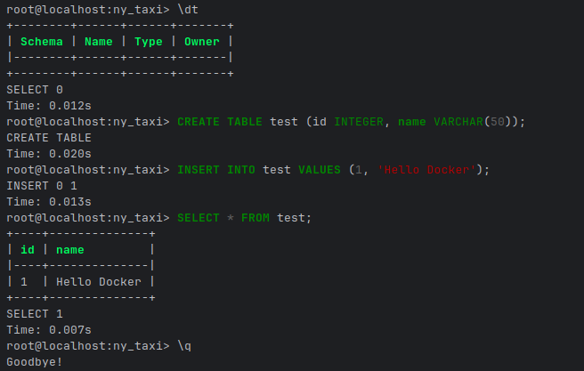
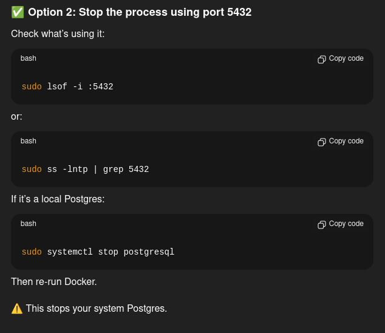

Running PostgreSQL with DOcker (example - 04)

What worked!!!

docker run -it --rm \
  -e POSTGRES_USER="root" \
  -e POSTGRES_PASSWORD="root" \
  -e POSTGRES_DB="ny_taxi" \
  -v ny_taxi_postgres_data:/var/lib/postgresql \
  -p 5432:5432 \
  postgres:18

Error fix... this and check 'docker ps' to see your running containers incase you need to stop the one running docker. 
